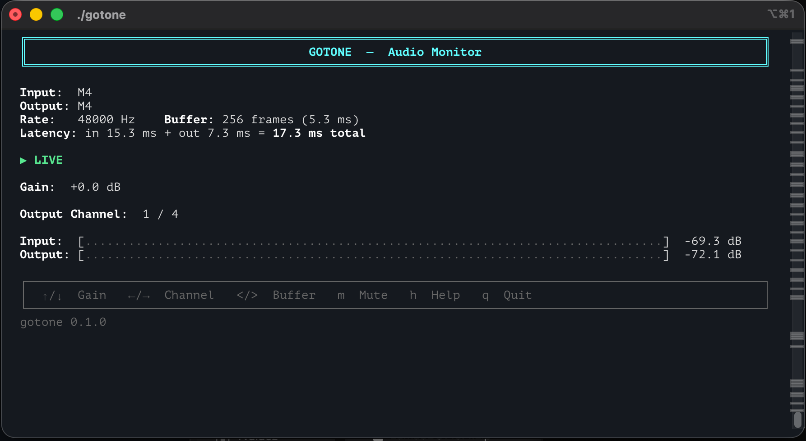

# GoTone - Audio Monitor

[](https://github.com/driconrikus/gotone/actions/workflows/ci.yml)
[](https://github.com/driconrikus/gotone/releases/latest)

A lightweight, real-time audio monitor and router for your terminal. Route audio from any input to any output channel with minimal latency.



## What it does

You want a quick test of your instrument but find dowloading and setting up a full DAW too much of a hassle? GoTone has your back! it takes audio from an input device (e.g. a guitar through your Audio Interface) and routes it to a specific output channel in real-time. Think of it as a terminal-based monitoring utility — the kind of thing your audio interface's control software does, but without the GUI.

## Features

- **Zero-latency monitoring** — direct input-to-output routing via PortAudio duplex streams
- **Output channel selector** — route to any channel on multi-output interfaces (e.g. channels 1-4 on MOTU M4)
- **Live gain control** — adjustable from -60 dB to +24 dB
- **Mute toggle** — instant mute/unmute
- **Real-time level meters** — RMS meters with peak hold, 10 fps refresh
- **Adjustable buffer size** — trade latency for CPU (16 to 4096 frames)
- **Cross-platform** — macOS, Linux, Windows

## Install

Requires [PortAudio](http://www.portaudio.com/) and Go 1.26.5+.

```bash
# macOS
brew install portaudio pkgconf

# Debian/Ubuntu
sudo apt install portaudio19-dev

# Then build
go build -o gotone
```

## Usage

### Interactive mode (recommended)

```bash
./gotone
```

Walks you through selecting input device, output device, and output channel.

### CLI flags

```bash
./gotone --input 4 --output 4 --channel 3 --sample-rate 48000 --buffer-size 256 --gain 0
```

| Flag | Default | Description |
|------|---------|-------------|
| `--input` | interactive | Input device index |
| `--output` | interactive | Output device index |
| `--channel` | 1 | Output channel (1-indexed) |
| `--sample-rate` | 48000 | Sample rate in Hz |
| `--buffer-size` | 256 | Frames per buffer (lower = less latency) |
| `--gain` | 0.0 | Initial gain in dB |
| `--list-devices` | | List all audio devices and exit |

### Keyboard controls

| Key | Action |
|-----|--------|
| ↑ / ↓ | Gain +1 dB / -1 dB |
| ← / → | Output channel -1 / +1 |
| , / . | Buffer size ×2 / ÷2 |
| m | Mute / unmute |
| h | Show/hide help |
| q | Quit |

## Example

```bash
./gotone --list-devices

=== INPUT DEVICES ===
  [ 4] M4 (max 8 ch)

=== OUTPUT DEVICES ===
  [ 4] M4 (max 4 ch)

./gotone --input 4 --output 4 --channel 3
```

## Project structure

```
gotone/
├── main.go             # CLI, device selection, signal handling
├── signals_unix.go     # Unix signal handling
├── signals_windows.go  # Windows signal handling
├── engine/
│   └── engine.go       # PortAudio duplex stream, gain, mute, routing
├── tui/
│   ├── tui.go          # Terminal UI, meters, help overlay, keyboard input
│   └── input_windows.go # Windows console input
├── go.mod
└── go.sum
```

## Releasing

This project uses gitflow:

- **`main`** — stable releases (`v1.0.0`, `v1.0.1`)
- **`develop`** — beta builds (`v1.0.0-beta.1`, `v1.0.0-beta.2`)
- Feature branches off `develop`

### Beta release

```bash
git checkout develop
git tag v0.1.0-beta.1
git push origin v0.1.0-beta.1
```

### Stable release

```bash
git checkout main
git merge develop
git tag v0.1.0
git push origin v0.1.0
```

Both trigger a GitHub Actions build that produces binaries for macOS (arm64, amd64), Linux (amd64, arm64), and Windows (amd64). Beta tags are marked as pre-releases.

## To-dos

- [ ] 10-band EQ (WIP)
- [ ] VST / AU plugin hosting (future)

Suggestions are very much welcome, open an issue or PR!

## Support

If you find GoTone useful, consider buying me a coffee:

[](https://www.paypal.com/paypalme/driconrikus)

## License

MIT
